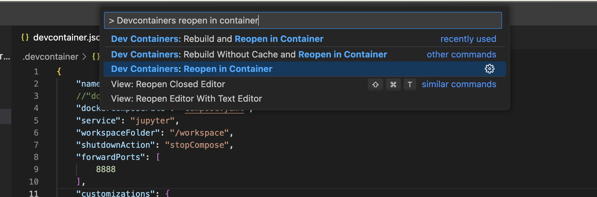

# Jupyter devcontainer template with pytest

Quickly set up a reproducible notebook environment with sane testing defaults

All work you do inside the container will be synced to your host machine, while still allowing you to do all development in a completely isolated environment. 

## Start dev containers

1. Install Docker Desktop
2. Inside VSCode
    1. Open **Command Pallette** by pressing `F1` 
    2. Select `> Dev Containers: Reopen in Container`
    

> [!TIP]
> You will need to rebuild the container if you make changes to the dockerfile or the devcontainer.json which configures it

## Licence

Forked from [shinyay](https://github.com/shinyay) using the [MIT license](https://gist.githubusercontent.com/shinyay/56e54ee4c0e22db8211e05e70a63247e/raw/34c6fdd50d54aa8e23560c296424aeb61599aa71/LICENSE) 
